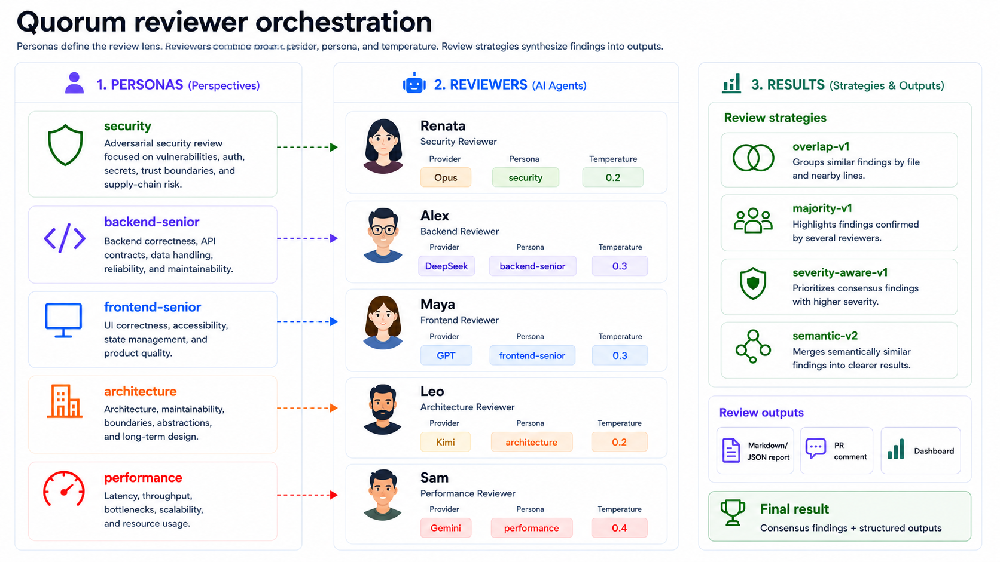

# Quorum



[](https://github.com/S1933/quorum/actions/workflows/ci.yml)
[](https://bun.sh)
[](https://www.typescriptlang.org/)

Provider-agnostic consensus review for AI-assisted code changes.

Quorum runs multiple AI reviewers on a git diff and highlights findings they agree on.
Works as a Bun CLI.

## Features

- Multi-reviewer consensus on the same git diff, with findings grouped by file, line, and category.
- Provider-agnostic execution across APIs, local models, and agent CLIs.
- YAML-defined personas, reviewer providers, file filters, and parallel or sequential pipelines.
- Terminal progress plus Markdown/JSON reports, available from the CLI.
- Archived timestamped reports in `.quorum/reviews/` for every review and plan-review run.
- Token usage & cost breakdown per reviewer in markdown reports (input/output tokens, total cost).
- Interactive terminal dashboard (`quorum dashboard`) to browse pipelines and archived review history.

## Supported Providers

| Status | Provider | Type |
|---|---|---|
| 🟢 → | OpenRouter | `openrouter` |
| 🟢 → | Claude Code | `claude-code` |
| 🟢 → | Codex CLI | `codex-cli` |
| 🟢 → | Cursor Agent CLI | `cursor-agent` |
| 🟢 → | Gemini CLI | `gemini-cli` |
| 🟢 → | Kilo Code CLI | `kilo-code` |
| 🟢 → | OpenCode | `opencode` |
| 🟢 → | Ollama | `ollama` |

## Requirements

- [Bun](https://bun.sh) `>= 1.1`

## Install

```bash
git clone https://github.com/S1933/quorum.git
cd quorum
bun install && bun link
```

Optionally copy the environment template:

```bash
cp .env.example .env   # then edit .env with your API key
```

## Quick start

Ask your coding agent to initialize the first reviewer:

```text
Create my first Quorum reviewer using the security persona,
the OpenRouter provider, and model anthropic/claude-sonnet-4.
```

Equivalent command:

```bash
quorum reviewer add \
  --provider=openrouter \
  --persona=security \
  --model=anthropic/claude-sonnet-4
```

On a new project, this creates `quorum.yaml` from `quorum.yaml.example`, then adds the reviewer to the default pipeline.

Then ask for a Quorum review:

```text
Run Quorum review on the current git diff.
```

Equivalent command:

```bash
quorum review
```

## Prompt examples

Use these prompts with Codex or another coding agent in a project that has Quorum installed. Prompts that mention "Quorum review" are handled by the bundled `skills/review/SKILL.md` wrapper, which runs the CLI and returns exact output.

### Create a reviewer

Prompt:

```text
Create a Quorum reviewer named architect-minimax using the architecture persona,
the opencode provider, and model opencode-go/minimax-m3.
```

Equivalent command:

```bash
quorum reviewer add \
  --id=architect-minimax \
  --persona=architecture \
  --provider=opencode \
  --model=opencode-go/minimax-m3
```

Expected result in `quorum.yaml`:

```yaml
reviewers:
  architect-minimax:
    persona: architecture
    provider:
      type: opencode
      model: opencode-go/minimax-m3

pipelines:
  default:
    reviewers:
      - architect-minimax
```

### Run Quorum review

Prompts:

```text
Run Quorum review on the current git diff.
Run Quorum review with --pipeline ci.
Run Quorum review against origin/main and write the report to .quorum/review.md.
Run Quorum review as JSON with --report .quorum/review.json.
Run Quorum review only for src/**/*.ts.
```

Equivalent commands:

```bash
quorum review
quorum review --pipeline ci
quorum review --base origin/main --report .quorum/review.md
quorum review --json --report .quorum/review.json
quorum review --include "src/**/*.ts"
```

## CLI Commands

### `quorum reviewer add`

```
quorum reviewer add \
  --provider=<type> \
  --persona=<name> \
  --model=<model> \
  [--variant=<variant>] \
  [flags]
```

| Flag | Description |
|------|-------------|
| `--provider` *required* | `openrouter`, `claude-code`, `codex-cli`, `cursor-agent`, `gemini-cli`, `kilo-code`, `opencode`, `ollama` |
| `--persona` *required* | Persona defined in `quorum.yaml` |
| `--model` *required* | Model for this provider (see examples above) |
| `--variant` | Provider-specific model variant or reasoning effort (Claude Code maps to `--effort`; OpenCode maps to `--variant`; Codex CLI maps to `model_reasoning_effort`; OpenRouter maps to `reasoning.effort`) |
| `--id` | Custom reviewer ID (default: `<name>-<persona>-<provider>`) |
| `--ext`, `--fileExtensions` | File extension filter, comma-separated (e.g. `ts,tsx`) |
| `--temperature` | Reviewer model temperature override, from `0` to `2` |
| `--pipeline` | Target pipeline (default: `defaults.pipeline`, then `default`) |
| `--config` | Path to `quorum.yaml` (default: `./quorum.yaml`) |

```bash
# OpenRouter
quorum reviewer add \
  --provider=openrouter \
  --persona=security \
  --model=anthropic/claude-sonnet-4 \
  --variant=high

# Claude Code
quorum reviewer add \
  --provider=claude-code \
  --persona=security \
  --model=sonnet \
  --variant=high

# Codex CLI
quorum reviewer add \
  --provider=codex-cli \
  --persona=security \
  --model=gpt-5-codex \
  --variant=high

# Cursor Agent CLI
quorum reviewer add \
  --provider=cursor-agent \
  --persona=security \
  --model=composer-2.5-fast

# Gemini CLI
quorum reviewer add \
  --provider=gemini-cli \
  --persona=security \
  --model=gemini-2.5-pro

# Kilo Code CLI
quorum reviewer add \
  --provider=kilo-code \
  --persona=security \
  --model=anthropic/claude-sonnet-4

# OpenCode
quorum reviewer add \
  --provider=opencode \
  --persona=security \
  --model=opencode-go/deepseek-v4-pro \
  --variant=high

# Ollama
quorum reviewer add \
  --provider=ollama \
  --persona=security \
  --model=qwen2.5-coder
```

```bash
quorum reviewer add \
  --provider=claude-code \
  --persona=backend-senior \
  --model=sonnet \
  --fileExtensions=go \
  --temperature=0.2 \
  --id=backend-go-reviewer \
  --pipeline=default
```

#### Run a review pipeline

```
quorum review [--pipeline=<id>] [flags]
```

| Flag | Description |
|------|-------------|
| `--pipeline` | Pipeline to run (overrides positional) |
| `--base` | Git ref to diff against (auto-detects `origin/main`) |
| `--format` | Output format: `text` | `json` (default: `text`) |
| `--json` | Shorthand for `--format json` |
| `--report` | Write report to file |
| `--allow-report-outside-root` | Permit `--report` paths outside the git repository |
| `--include` | Comma-separated glob patterns to include |
| `--exclude` | Comma-separated glob patterns to exclude |
| `--max-diff-bytes` | Clip diff to byte budget |
| `--no-color` / `--no-preview` | Quiet terminal output |
| `--config` | Path to `quorum.yaml` |

```bash
quorum review                                       # default pipeline
quorum review --pipeline ci                         # named pipeline
quorum review --json                                # JSON to stdout
quorum review --json --report .quorum/review.json   # JSON to file
quorum review --base origin/main                    # specific git ref
quorum review --include "src/**/*.ts"               # filter by glob
quorum review --no-preview --no-color               # quiet mode
```

Every review and plan-review run is also automatically archived to `.quorum/reviews/` with a timestamped filename. Markdown reports now include a **Token Usage** table showing input/output tokens and cost per reviewer.

#### Review an implementation plan

```
quorum plan-review <plan-file> [--pipeline=<id>] [flags]
```

Runs the same multi-reviewer pipeline against a Markdown/text plan file. Reports include normal findings plus a plan verdict: `approve`, `revise`, or `block`.

```bash
quorum plan-review docs/plan.md
quorum plan-review docs/plan.md --json
quorum plan-review docs/plan.md --report .quorum/plan-review.md
```

#### Interactive dashboard

```
quorum dashboard [--config=<path>]
```

Opens a terminal TUI to browse configured pipelines and review history.

| Key | Action |
|-----|--------|
| `↑` / `↓` | Navigate list |
| `←` / `→` or `Tab` | Switch between Pipelines & Reviews tabs |
| `Enter` | Expand pipeline reviewers / open full review |
| `Esc` | Go back / exit |
| `q` | Quit |

- **Pipelines tab** — lists all pipelines from `quorum.yaml` with mode, reviewer count, and consensus strategy. Press `Enter` to expand inline reviewer details (persona, provider, model).
- **Reviews tab** — shows archived reports from `.quorum/reviews/` with timestamp, pipeline, finding count, severity breakdown, and duration. Press `Enter` to read the full report.

## CI Integration

Add the Quorum GitHub Action to your workflows to review every PR.

### 1. Add a `ci` pipeline to `quorum.yaml`

CI pipelines must use API-based providers (OpenRouter). Subprocess CLIs (`claude-code`, `gemini-cli`, etc.) are not available in GitHub Actions runners.

```yaml
reviewers:
  ci-security:
    persona: security
    provider:
      type: openrouter
      model: anthropic/claude-sonnet-4
      api_key: env:OPENROUTER_API_KEY
  ci-backend:
    persona: backend-senior
    provider:
      type: openrouter
      model: anthropic/claude-sonnet-4
      api_key: env:OPENROUTER_API_KEY

pipelines:
  ci:
    parallel: true
    reviewers:
      - ci-security
      - ci-backend
    consensus:
      strategy: severity-aware-v1
```

### 2. Add `OPENROUTER_API_KEY` to your repository secrets

In **Settings > Secrets and variables > Actions**, add `OPENROUTER_API_KEY`.

### 3. Add the workflow

```yaml
# .github/workflows/quorum-review.yml
name: Quorum Review
on:
  pull_request:
    types: [opened, synchronize, reopened]

permissions:
  contents: read
  pull-requests: write

jobs:
  review:
    runs-on: ubuntu-latest
    steps:
      - uses: actions/checkout@v4
        with:
          fetch-depth: 0  # required for git diff base detection

      - uses: s1933/quorum@v1
        with:
          fail_on: high
          openrouter_api_key: ${{ secrets.OPENROUTER_API_KEY }}
```

### Inputs

| Input | Default | Description |
|-------|---------|-------------|
| `pipeline` | `ci` | Pipeline ID in `quorum.yaml` |
| `config` | `quorum.yaml` | Path to config file |
| `fail_on` | `critical` | Minimum severity to fail the check (`critical`, `high`, `medium`, `never`) |
| `max_diff_bytes` | `200000` | Clip diff to byte budget |
| `openrouter_api_key` | | OpenRouter API key (required) |

### PR comment

The action posts a single PR comment (updated on each push) with a severity summary and detailed findings. Critical and high findings are expanded by default.

### Fork PRs

GitHub does not pass secrets to fork PRs. The action posts a skip notice instead of failing.

## Consensus

Findings are grouped when they share the same file, line range (±2 lines), and category.
Categories: `security`, `performance`, `architecture`, `correctness`, `style`.
Groups reaching the promotion threshold get an **agreement badge**; others are reported
individually.

### Strategies

Selected per pipeline via `consensus: { strategy: <id> }`:

| Strategy | Rule | Threshold |
|---|---|---|
| `overlap-v1` | Absolute | ≥ `requireAgreement` (default 2) |
| `majority-v1` | Strict majority | > n/2, min 2 |
| `severity-aware-v1` | Severity-scaled | crit/high→1, med→2, low/info→3 |

**Example** — 3 reviewers, `requireAgreement: 2`:

```
Finding           A   B   C   overlap-v1      majority-v1     severity-aware-v1
auth:42 (crit)    ✓   ✓   ·   promoted        promoted        promoted (≥1)
auth:45 (med)     ·   ✓   ✓   —               promoted        promoted (≥2)
db:10 (low)       ✓   ·   ·   —               —               — (needs ≥3)
```

See [`docs/ARCHITECTURE.md`](docs/ARCHITECTURE.md) for deeper design notes.

## Security model

Quorum treats diffs as untrusted prompt input, but local agent providers still execute
local CLI binaries. Use local providers only in repositories and configs you trust.

- Subprocess provider output is size-capped and terminal-rendered text is sanitized.
- Provider subprocesses receive a minimal environment plus explicit provider secrets only.
- Provider binaries inside the repository are refused unless that provider config sets
  `allow_project_binary: true`.
- `--report` writes inside the repository by default. Use `--allow-report-outside-root`
  only when you intentionally want an external report path.

## Credits

Created by [S1933](https://github.com/S1933). Licensed under MIT — do whatever you want with it.
