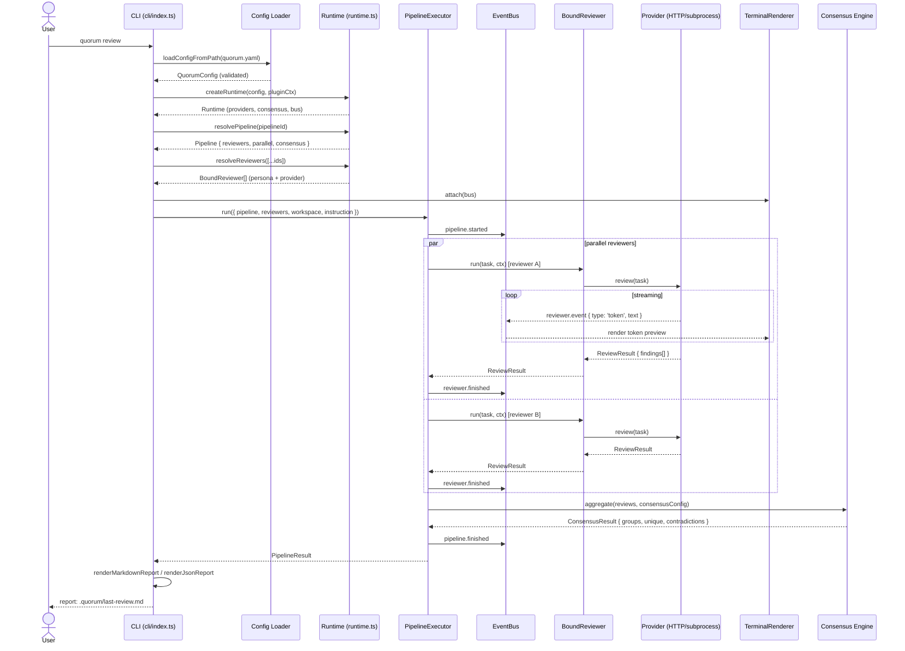

# Quorum — Architecture

> Status: **implemented v0.1** · scope: architecture and implementation map · last updated 2026-06-13

Quorum is a provider-agnostic review runtime for AI-assisted code changes. Its differentiator is **multi-model consensus review**: when implementation is complete, the same reviewer persona is run across multiple providers, and a consensus engine aggregates and deduplicates findings like a team review meeting made only of LLM reviewers.

This document defines the domain model, layer boundaries, interfaces, shipped surfaces, and deferred work.

Accepted architecture decisions are tracked in [Architecture Decision Records](adr/README.md).

---

## 1. Design principles

1. **Provider ≠ Model.** Providers are access points (HTTP/subprocess/SDK). Models are configuration *within* a provider. OpenRouter, LiteLLM, and Ollama each expose many models — the abstraction must reflect that.
2. **Personas are portable.** A persona (system prompt + role) is decoupled from any provider. The same `paranoid-security` persona running on two different providers is the unit of consensus.
3. **Core has no I/O.** `core/` defines types and pure logic. All network, filesystem, and subprocess work lives in `providers/` or `runtime/`.
4. **Event-driven, not callback soup.** A single event bus carries lifecycle events. UIs subscribe; they do not poll.
5. **Provider variety validates the seam.** Quorum ships HTTP and local subprocess adapters, but they all satisfy the same review-focused provider interface.
6. **Consensus stays pragmatic.** Default consensus groups findings by file+line overlap and emits an "N agreed" badge. Additional strategies exist, but trust scoring and smart routing remain out of scope.
7. **Claude Code skill is a *distribution*, not the *runtime*.** The core is a Bun library + CLI; the skill is a thin adapter.

---

## 2. Domain model

The vocabulary the rest of the codebase enforces.

| Concept | What it is | What it is *not* |
|---|---|---|
| **Provider** | A registered runtime that can review prompts/diffs. Owns auth, transport, model dispatch. | A specific model. A reviewer. A persona. |
| **Model** | A string identifier (e.g. `anthropic/claude-opus-4`) plus per-call parameters (temperature, max tokens). Lives inside provider config. | An object with behavior. It's data. |
| **Persona** | A system prompt + role declaration + (optional) output schema hint. | Bound to a provider. |
| **Reviewer** | `(Persona, ProviderRef, overrides)` — a persona *bound* to a provider for execution. | A persona. A provider. |
| **ReviewTask** | "Critique this." Diff, files, or prompt + persona-targeted instruction. Producer of `Finding[]`. | An implementation task. |
| **Finding** | One issue: `{file, lineRange, severity, category, title, body, reviewer}`. | A whole review. |
| **Pipeline** | A named, ordered or parallel set of `ReviewerRef`s with optional consensus config. | A reviewer. |
| **Consensus** | Aggregation, dedup, optional contradiction detection across `ReviewResult`s. | Persistent reviewer reputation or routing. |

Three-tier hierarchy: **Provider → Reviewer → Pipeline.** Personas hang off Reviewers. Findings flow up through Consensus.

---

## 3. Layer architecture

```
┌──────────────────────────────────────────────────────────────┐
│  Distribution: CLI · Claude Code skill · GitHub Action       │
├──────────────────────────────────────────────────────────────┤
│  UI: terminal renderer · TUI · markdown/json reports         │
├──────────────────────────────────────────────────────────────┤
│  Runtime: event bus · provider/consensus registries · config │
├──────────────────────────────────────────────────────────────┤
│  Pipelines: parallel/sequential executor · timeout · budget  │
├──────────────────────────────────────────────────────────────┤
│  Reviewers (Persona+Provider binding)   Consensus engine     │
├──────────────────────────────────────────────────────────────┤
│  Provider adapters: openrouter · ollama · claude-code · codex-cli │
│  · gemini-cli · kilo-code · opencode · cursor-agent              │
├──────────────────────────────────────────────────────────────┤
│  Core: types, schemas, pure logic — no I/O                   │
└──────────────────────────────────────────────────────────────┘
```

Dependencies point downward only. `core/` imports nothing from the project. `providers/` import from `core/`. `pipelines/` import from `core/` + `providers/` (via interface). UI imports from runtime events. Distribution wraps everything.

---

## 4. Provider abstraction

The single load-bearing interface.

```ts
// src/core/provider.ts
export interface Provider {
  readonly id: string;

  capabilities(): ProviderCapabilities;

  review?(task: ReviewTask, ctx: ExecCtx): Promise<ReviewResult>;

  dispose?(): Promise<void>;
}

export interface ProviderCapabilities {
  review: boolean;         // can it produce structured findings?
  streaming: boolean;
  tools: boolean;          // function/tool calling
  mcp: boolean;            // MCP server support
  localExecution: boolean; // runs on-host (ollama, local CLI providers)
  maxConcurrentReviews?: number;
}

export interface ExecCtx {
  bus: EventBus;
  signal: AbortSignal;
  workspace: WorkspaceInfo;
  modelOverride?: ModelConfig;
  reviewerId?: string;
}
```

**Design choices:**

- `review` is the load-bearing provider method. Providers may wrap HTTP APIs, local CLIs, or SDKs, but Quorum only asks them for structured review findings.
- `capabilities.streaming` describes whether review execution emits token previews; streaming is observable through `reviewer.event` events, not a separate provider method.
- `maxConcurrentReviews` lets local CLI providers constrain parallel pipeline execution when the underlying binary cannot run safely in parallel.
- `ExecCtx` carries the event bus by reference — providers emit events, they don't return them. Decouples observability from return values.

**ProviderEvent contract:**

```ts
type ProviderEvent =
  | { type: 'token';   text: string }
  | { type: 'tool_call'; name: string; args: unknown }
  | { type: 'finding'; finding: Finding }
  | { type: 'log';     level: 'info' | 'warn' | 'error'; msg: string }
  | { type: 'usage';   inputTokens: number; outputTokens: number; costUsd?: number };
```

Bounded, finite event set. Anything new requires a discriminator addition (caught by exhaustive switch in TS).

---

## 5. Provider registry & plugin lifecycle

Providers are registered, not imported, so external plugins can drop them in.

```ts
// src/providers/registry.ts
export interface ProviderFactory {
  type: string;                                 // 'openrouter', 'claude-code', 'ollama', …
  schema: z.ZodTypeAny;                         // zod schema for this provider's config block
  create(instanceId: string, config: unknown, ctx: PluginCtx): Promise<Provider>;
  createMetaReviewer?(config: unknown, ctx: PluginCtx): MetaReviewFn | undefined;
}

export class ProviderRegistry {
  register(factory: ProviderFactory): void;
  resolve(type: string): ProviderFactory | undefined;
  instantiate(id: string, cfg: unknown, ctx: PluginCtx): Promise<Provider>;
  list(): string[];
}
```

Lifecycle: `register` → (config load) → `instantiate` → `create` → (use) → `dispose`. Built-in providers (openrouter, ollama, claude-code, codex-cli, gemini-cli, kilo-code, opencode/open-code-go, cursor-agent) are registered at runtime boot. External provider plugins are **not yet supported** — the registry API is designed to accommodate them, but no discovery or loading mechanism exists. A future `@quorum/plugin-*` package convention remains open.

---

## 6. Configuration schema

YAML, validated via zod, env interpolation via `env:VAR` and `${VAR}`.

```yaml
# quorum.yaml
version: 1

defaults:
  pipeline: default

personas:
  security:
    description: Adversarial security review
    system: |
      You are an adversarial security reviewer. Focus on injection,
      authn/authz, secret handling, and unsafe deserialization. Be specific.

  performance:
    description: Latency and resource cost review
    system: |
      You are a performance reviewer. Flag N+1 queries, sync I/O on hot paths,
      unbounded loops, memory leaks. Cite line numbers.

  architecture:
    description: Maintainability and design review
    system: |
      You are a principal engineer. Focus on layering violations, leaky
      abstractions, and testability. Prefer fewer, deeper findings.

reviewers:
  sec-opus:
    persona: security
    provider:
      type: openrouter
      api_key: env:OPENROUTER_API_KEY
      model: anthropic/claude-opus-4
      temperature: 0.2
  sec-gpt:
    persona: security
    provider:
      type: openrouter
      api_key: env:OPENROUTER_API_KEY
      model: openai/gpt-5-codex
      temperature: 0.2
  perf-opus:
    persona: performance
    provider:
      type: openrouter
      api_key: env:OPENROUTER_API_KEY
      model: anthropic/claude-opus-4
      temperature: 0.2
  arch-opus:
    persona: architecture
    provider:
      type: claude-code
      model: claude-opus-4-7

pipelines:
  default:
    parallel: true
    reviewers: [sec-opus, perf-opus, arch-opus]
    consensus: { strategy: overlap-v1 }
    timeoutMs: 300000
    maxConcurrency: 3
    maxTotalCostUsd: 1.00

  consensus-security:
    parallel: true
    reviewers: [sec-opus, sec-gpt]      # same persona, different providers
    consensus: { strategy: overlap-v1, requireAgreement: 2 }

  semantic:
    parallel: true
    reviewers: [sec-opus, perf-opus, arch-opus]
    consensus:
      strategy: semantic-v2
      similarityThreshold: 0.78
      enableContradictions: true
```

**Schema notes:**

- `reviewers.*.provider` embeds the provider config (`type`, `model`, auth, transport options).
- `reviewers.*.overrides` can override `model`, `temperature`, `maxTokens`, and `topP` without duplicating provider auth.
- `reviewers.*.fileExtensions` can scope reviewers to changed-file extensions before execution.
- Pipelines reference reviewers by id; they never embed persona/provider inline.
- `consensus.strategy` is a registry key; shipped strategies are `overlap-v1`, `majority-v1`, `severity-aware-v1`, and `semantic-v2`.
- Pipeline guards include `timeoutMs`, `maxConcurrency`, `maxReviewers`, and `maxTotalCostUsd`.

Loader resolves `env:` lazily so missing keys fail at provider instantiation, not at config-parse time — better error locality.

---

## 7. Orchestration engine

Two execution modes: **parallel** and **sequential**. No DAG yet.

```ts
export interface PipelineResult {
  pipelineId: string;
  reviews: ReviewResult[];         // one per reviewer
  consensus: ConsensusResult;       // produced by the consensus engine
  durationMs: number;
  errors: ReviewerError[];          // partial-failure tolerated
  verdictSummary?: {
    decision: 'approve' | 'revise' | 'block';
    counts: Record<'approve' | 'revise' | 'block', number>;
    summaries: Array<{
      reviewerId: string;
      decision: 'approve' | 'revise' | 'block';
      summary: string;
      confidence?: 'low' | 'medium' | 'high';
    }>;
  };
  budgetExceeded?: boolean;
  totalCostUsd?: number;
}
```

**Failure policy:** *continue on reviewer failure*, surface the error in the report. Aborting the whole pipeline because one reviewer's API key is bad is the wrong default — the user wants partial signal.

**Cancellation:** Single `AbortSignal` from the entry point propagates to all reviewers via `ExecCtx`. Pipeline-level timeout cancels all in-flight reviewers and emits a `pipeline.timeout` event.

**Backpressure:** Parallel pipelines honor `pipeline.maxConcurrency` and provider `maxConcurrentReviews`; the executor uses the lower configured limit. Rate-limit-aware scheduling remains future work.

**Budget guard:** `maxTotalCostUsd` tracks provider-reported usage. Once the limit is exceeded, Quorum emits `pipeline.budget_exceeded`, aborts in-flight work, and returns partial results plus `budgetExceeded`.

---

## 8. Review execution flow

The following diagram traces a complete `quorum review` run — from CLI invocation through config loading, reviewer execution (parallel), event streaming to the terminal, consensus aggregation, and final report output.



**Key observations:**
- Config loading and runtime creation happen once, before any reviewer runs.
- Pipeline executor handles the parallel/sequential dispatch; individual reviewers are isolated from each other.
- EventBus decouples execution from rendering — the terminal renderer subscribes to events without blocking the pipeline.
- Consensus aggregates after all reviewers finish (parallel mode waits for the slowest).
- Partial failure is tolerated: if one reviewer fails, the pipeline continues and the error appears in the report.

---

## 9. Consensus engine

Consensus is pluggable through `ConsensusRegistry`; each strategy consumes `ReviewResult[]` and returns a stable `ConsensusResult` for renderers.

```ts
// src/consensus/registry.ts
export interface ConsensusStrategy<C extends ConsensusConfig = ConsensusConfig> {
  id: C['strategy'];
  aggregate(
    reviews: ReviewResult[],
    cfg: C,
    ctx?: ConsensusContext,
  ): ConsensusResult | Promise<ConsensusResult>;
}

export interface ConsensusResult {
  groups: FindingGroup[];           // overlapping/duplicate findings collapsed
  agreement: Record<string, number>; // groupId -> # of reviewers that raised it
  unique: Finding[];                // findings raised by exactly one reviewer
  contradictions: Contradiction[];
  strategyId: string;
}

export interface FindingGroup {
  id: string;
  representative: Finding;          // chosen for display
  members: Finding[];               // every finding in this group
  reviewers: string[];              // unique reviewer ids that contributed
}
```

**Shipped strategies:**

- `overlap-v1` groups by same file, nearby line range, and same category.
- `majority-v1` keeps groups that meet `requireAgreement`.
- `severity-aware-v1` allows per-severity agreement thresholds.
- `semantic-v2` groups by text similarity and can optionally use a meta-review provider for contradiction notes.

**Default strategy: `overlap-v1`**

Group two findings together iff:
1. Same file path, *and*
2. Line ranges overlap (or are within ±2 lines), *and*
3. Same category (`security` | `performance` | `architecture` | `correctness` | `style`).

Title/body are *not* compared semantically. Lexical near-duplicates may still be split — that's acceptable for the default path. The "N reviewers agreed" badge gives the user signal even if grouping isn't perfect.

**Still deferred:**
- Per-reviewer trust scores from user feedback (👍/👎 in the UI).
- Weighted voting where reviewers known to hallucinate get downweighted.

**Why this is enough:** the user gets signal about which findings are widely agreed-upon — the central UX promise. Perfect dedup is not required to deliver that.

---

## 10. Event system

Single in-process pub/sub. `EventBus` is the only cross-cutting collaborator besides `core/` types.

```ts
type QuorumEvent =
  | { type: 'pipeline.started';  pipelineId: string; reviewers: string[] }
  | { type: 'reviewer.started';  reviewerId: string }
  | { type: 'reviewer.event';    reviewerId: string; event: ProviderEvent }
  | { type: 'reviewer.finished'; reviewerId: string; result: ReviewResult }
  | { type: 'reviewer.failed';   reviewerId: string; error: ReviewerError }
  | { type: 'pipeline.finished'; result: PipelineResult }
  | { type: 'pipeline.timeout' }
  | { type: 'pipeline.budget_exceeded'; spent: number; limit: number }
  | { type: 'questions.collected'; count: number }
  | { type: 'questions.waiting' }
  | { type: 'questions.answered'; count: number };

export interface EventBus {
  emit(e: QuorumEvent): void;
  on<K extends QuorumEvent['type']>(type: K, fn: (e: Extract<QuorumEvent, {type: K}>) => void): () => void;
  onAny(fn: (e: QuorumEvent) => void): () => void;
}
```

The terminal renderer subscribes to runtime events for live progress. Interactive review mode uses the question events to collect clarifications before final findings. Markdown and JSON reports render the final `PipelineResult`, keeping report generation deterministic and easy to test.

---

## 11. Distribution surfaces

The CLI is the primary runtime surface. Other integrations shell out to it or reuse `src/cli/index.ts`.

**CLI commands:**

- `quorum review` — review the current diff and write `.quorum/last-review.md` unless JSON or a custom report path is requested.
- `quorum plan-review <plan-file>` — review an implementation plan and produce a verdict summary.
- `quorum reviewer add` — add a reviewer to `quorum.yaml`.
- `quorum dashboard` — launch the Ink TUI dashboard.

**Integrations:**

- `skills/review/SKILL.md` — Claude Code skill wrapper around the CLI.
- `action.yml` + `src/ci/report-check.ts` — GitHub Action entry point and report validation.

**Boundary contract:** integrations stay thin. Domain logic belongs in `src/core/`, provider adapters, the pipeline executor, consensus strategies, and renderers.

---

## 12. Folder structure

```
quorum/
├── skills/
│   └── review/
│       └── SKILL.md
├── src/
│   ├── ci/
│   │   └── report-check.ts
│   ├── cli/
│   │   ├── args.ts
│   │   ├── index.ts              # Bun entry point; reused by integrations
│   │   ├── report.ts
│   │   └── commands/
│   │       ├── dashboard.ts
│   │       ├── plan-review.ts
│   │       ├── review.ts
│   │       └── reviewer.ts
│   ├── config/
│   │   ├── schema.ts
│   │   ├── loader.ts
│   │   ├── interpolate.ts
│   │   ├── redact.ts
│   │   └── sensitive-fields.ts
│   ├── consensus/
│   │   ├── registry.ts
│   │   ├── overlap-v1.ts
│   │   ├── majority-v1.ts
│   │   ├── severity-aware-v1.ts
│   │   ├── semantic-v2.ts
│   │   └── contradictions.ts
│   ├── core/                # types, schemas, errors. No I/O.
│   │   ├── provider.ts
│   │   ├── task.ts
│   │   ├── finding.ts
│   │   ├── persona.ts
│   │   ├── pipeline.ts
│   │   ├── events.ts
│   │   └── errors.ts
│   ├── interactive/
│   │   └── qa.ts
│   ├── pipelines/
│   │   ├── budget.ts
│   │   └── executor.ts
│   ├── providers/
│   │   ├── registry.ts
│   │   ├── subprocess.ts          # shared runner + output normaliser
│   │   ├── base-subprocess.ts
│   │   ├── openrouter/            # HTTP provider
│   │   ├── ollama/                # HTTP provider
│   │   ├── claude-code/           # subprocess provider
│   │   ├── codex-cli/             # subprocess provider
│   │   ├── gemini-cli/            # subprocess provider
│   │   ├── kilo-code/             # subprocess provider
│   │   ├── opencode/              # subprocess provider
│   │   └── cursor-agent/          # subprocess provider
│   ├── reviewers/
│   │   ├── reviewer.ts            # binding logic; personas defined in quorum.yaml
│   │   └── output.ts
│   ├── runtime/
│   │   ├── bus.ts
│   │   ├── plugin.ts
│   │   ├── runtime.ts
│   │   └── workspace.ts
│   ├── ui/
│   │   ├── terminal.ts
│   │   ├── markdown.ts
│   │   ├── json.ts
│   │   ├── report-model.ts
│   │   └── tui/
│   └── index.ts
├── tests/
├── docs/
│   └── ARCHITECTURE.md     # this doc
├── action.yml
├── quorum.yaml.example
├── bunfig.toml
├── package.json
├── tsconfig.json
└── README.md
```

**Key observation:** `src/cli/index.ts` is the single command entry point. The skill and GitHub Action integration use stable, scriptable CLI behavior instead of duplicating review logic.

---

## 13. Shipped implementation map

| Area | Shipped state |
|---|---|
| **Core + config** | Zod-validated YAML, lazy env interpolation, redaction helpers, strict TypeScript domain types. |
| **Providers** | OpenRouter and Ollama HTTP adapters; Claude Code, Codex CLI, Gemini CLI, Kilo Code, OpenCode/open-code-go, and Cursor Agent subprocess adapters. |
| **Pipelines** | Parallel/sequential execution, partial failure tolerance, timeout propagation, provider/pipeline concurrency limits, cost budget aborts. |
| **Consensus** | `overlap-v1`, `majority-v1`, `severity-aware-v1`, and `semantic-v2` strategies. |
| **Review surfaces** | Diff review, plan review with verdict summary, interactive Q&A mode, terminal progress, markdown/JSON reports, archived reports. |
| **Distribution** | Bun CLI, Claude Code skill, GitHub Action metadata, Ink dashboard. |

The remaining architecture work is extension and hardening, not bootstrapping.

---

## 14. Risks & pragmatic tradeoffs

| Risk | Mitigation |
|---|---|
| **Provider interface ossifies too early.** | Keep provider capability flags small; add methods only after two adapters need the same shape. |
| **Consensus engine becomes a research project.** | Keep `overlap-v1` as the default. More advanced strategies must degrade to deterministic report output. |
| **Subprocess providers have varied I/O.** | Validated. Six subprocess providers (claude-code, codex-cli, gemini-cli, kilo-code, opencode, cursor-agent) share a common `createSubprocessProvider()`/`runSubprocess()` implementation with provider-specific args building and output normalization. |
| **Streaming is inconsistent across providers.** | Capability flag + fallback. UI must work without streaming; streaming is an upgrade, not a contract. |
| **Claude Code skill API drift.** | The skill layer is intentionally thin and shells out to `src/cli`. If Claude Code's skill shape changes, only the skill layer is affected. |
| **Cost runaway with parallel pipelines.** | Use `maxReviewers`, `maxConcurrency`, and `maxTotalCostUsd`; render final cost when providers report usage. |
| **YAML config sprawl.** | Starter `quorum.yaml.example`, `reviewer add`, and strict schemas keep config errors local. |

---

## 15. Out of scope

Explicit deferrals — capture here so they don't sneak in.

- DAG-based pipelines (parallel + sequential only).
- Per-reviewer trust scores and weighted voting.
- SaaS UI.
- Distributed reviewer execution / remote workers.
- Provider marketplace / plugin registry.
- Cost-optimizing smart router.
- Persistent memory across reviews.
- Aider and LiteLLM review providers (planned post-V1).

Implemented since the initial draft: Codex CLI, Cursor Agent, Gemini CLI, Kilo Code, and OpenCode are built-in subprocess providers; semantic consensus and contradiction notes exist behind `semantic-v2`; budget guards and GitHub Action plumbing are present.

---

## 16. Resolved design questions

The following questions from the original draft are now resolved by implementation:

1. **Reviewer config inheritance** — reviewers can override `temperature`, `maxTokens`, and `topP` via an `overrides` block on the reviewer config (`src/config/schema.ts`).
2. **Finding parsing** — subprocess providers parse JSON output via the shared normalizer in `src/providers/subprocess.ts`. HTTP providers use structured JSON response formats.
3. **Workspace context** — Quorum reads diffs via `git` directly (`src/runtime/workspace.ts`). The CLI is usable standalone; integrations pass only repo root, base ref, and flags.
4. **CLI shape** — commands are split into `src/cli/commands/` (`review`, `plan-review`, `reviewer`, `dashboard`); setup is handled by config/example files and reviewer mutation.
5. **Built-ins** — personas are defined in `quorum.yaml`; `src/reviewers/builtin/` has been removed.
